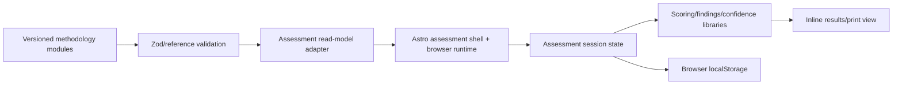

# System overview

The site is a static Astro application. Assessment pages render a shell and serialize categories/questions/methodology records into the page; browser JavaScript owns the interactive session, localStorage, scoring, findings, results, and print view. The browser imports shared finding and scoring cores, while some report-presentation and persistence logic remains inline.

`methodology/versions/v0.1.0.ts` assembles framework data, three capability modules, and legacy questions. `createAssessmentReadModel()` adds legacy category/standards/recommendation fields so the flat UI can consume modular questions. The browser imports `scoring-core.ts` and the shared finding evaluator; report presentation and persistence remain inline. There is no server API, database, authentication, uploaded evidence store, or integration boundary today. Lead capture is a `mailto:` link.
